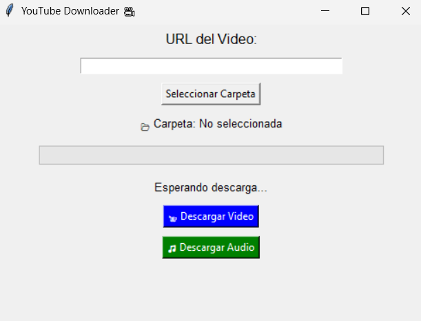

# **📥 YouTube Downloader 🎥**
Descarga fácilmente videos o audios de YouTube con una interfaz gráfica simple.  

✅ **Descarga videos en la mejor calidad disponible**  
✅ **Descarga solo el audio en formato MP3**  
✅ **Barra de progreso en tiempo real**  
✅ **Selección de carpeta de destino**   

---

## **📦 Instalación**
### **1️⃣ Clonar el repositorio**
```bash
git clone https://github.com/tu-usuario/tu-repositorio.git
cd tu-repositorio
```

### **2️⃣ Instalar dependencias**
Ejecuta el siguiente comando para instalar las librerías necesarias:
```bash
pip install -r requirements.txt
```

📌 **Contenido del `requirements.txt`**
```
yt-dlp
tk
```

---

## **🚀 Uso**
Ejecuta el siguiente comando en la terminal:
```bash
python youtube_downloader.py
```
👀 Se abrirá una ventana donde podrás pegar la URL del video, seleccionar una carpeta y elegir entre:  
- **📹 Descargar Video**
- **🎵 Descargar Audio**

---

## **🛠 Características**
### **📺 Descargar Video**
- Obtiene automáticamente la mejor calidad disponible.
- Guarda el archivo en la carpeta seleccionada.

### **🎵 Descargar Solo Audio**
- Descarga solo el audio.
- No requiere `ffmpeg`, todo se maneja con `yt-dlp`.

### **📊 Barra de Progreso**
- Muestra en tiempo real el avance de la descarga.
- Indica el porcentaje y el tamaño descargado.

---

## **🎨 Interfaz Gráfica**
La aplicación cuenta con una interfaz sencilla hecha con `tkinter`:

📌 **Vista previa de la interfaz (Opcional, si agregas imágenes)**  


---

## **📜 Licencia**
Este proyecto está bajo la licencia **MIT**. ¡Eres libre de modificarlo y distribuirlo!  

---

## **💡 Contribuciones**
Si quieres mejorar la aplicación, **haz un fork y envía un pull request**.

---

## **🚀 ¡Disfruta de tus descargas!**
Happy coding! 💻🎬🎶  
